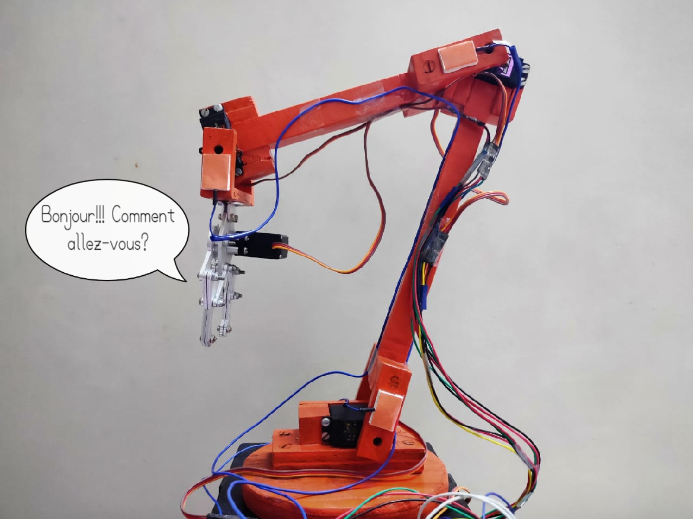

# Automated Collaborative Robotic Arm (A.C.R.A)

A.C.R.A is a 4 axis, articulate robotic arm which is capable of performing any physical operation autonomously ad infinitum by replicating a manually set sequence. It does this through the use of a teach pendant, which in this case is an EEPROM (Electrically Erasable Programmable Read Only Memory) that sequentially stores its joint values. These values, once stored, can be played back indefinitely to perpetually perform the same motion. In the event of any unexpected power cuts, the robot's operation would remain unhindered owing to the safe storage of coordinate values within the EEPROM, as opposed to being stored as int or double data types inside code which would render them more vulnerable to data loss. Another viable alternative to this is the use of an SD card which would be a significant upgrade with respect to data storage limits.

Additionally, the arm has a Capacitive based touch sensing feature to make it perceptive of physical contact. These touch sensors are implemented to mimic the collaboration features of collaborative bots (co-bots for short) on a cost-effective platform such as A.C.R.A. This method offers any robotics enthusiast the opportunity to make a low-cost versatile robot that can sufficiently emulate the basic features of collaborative bots. 

------

#### Prototype Details

The prototype illustrates the basic functionalities and expectations of A.C.R.A. For demonstration purposes, there are three touch sensors placed on arm joints, but additional sensors can be placed at key locations to make the arm more touch-perceptive and robust. 

- The micro controller used in this project was the **Arduino Mega 2560** which has an EEPROM (4096 bytes) possessing good storage capacity compared to Uno R3 (512 bytes). It also has a lot more I/O ports which can sustain operations even if the project is extended in future.
- A.C.R.A was controlled with **MG995 servos** (~9kg-cm of torque) which were good enough for a robotic arm of this size. If a bigger arm is desired it is highly recommended to look for servos with at least 22kg-cm or higher torque. 
- A servo motor driver was used to reduce the load on the Mega and increase the pulse width modulation resolution
  (frequently abbreviated PWM). **PCA9685 servo driver** was used here which offers 12-bit resolution for each output and an adjustable frequency PWM up to 1.6KHz.
- The **Capacitive touch sensors** were made from Aluminium foil which was then insulated with paper. 
- A **5v battery** for supplying power to the servos and the micro controller.

​      A.C.R.A sends its regards!!!

------

#### Video

The video below illustrates the teach pendant capability of A.C.R.A.

<video src="media/ACRA.mp4" width="720" height="480" controls preload></video>

The following video showcases the touch sensing feature of A.C.R.A.

<video src="media/Capsense.mp4" width="720" height="480" controls preload></video>

------

#### Current Progress

I am working on a full scale model of this arm which is modular in design and would span out to be approximately the size of a UR3. This would incorporate a ROS based package called MoveIt for motion planning. I am also considering replacing the Capacitive touch sensors with Force-Torque sensors which are widely used in the market today. But these sensors would be expensive when compared to the previous ones, and so touch based sensors would still stand as an inexpensive, economical choice. 

